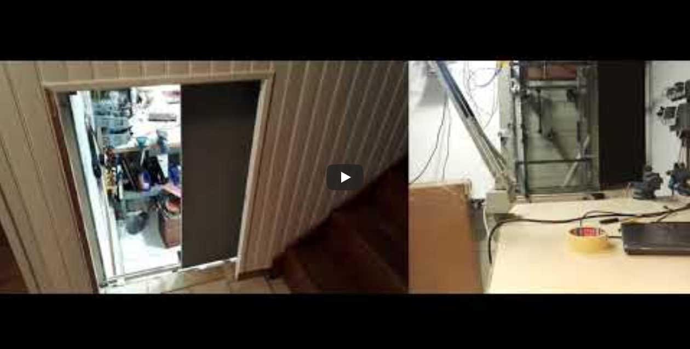
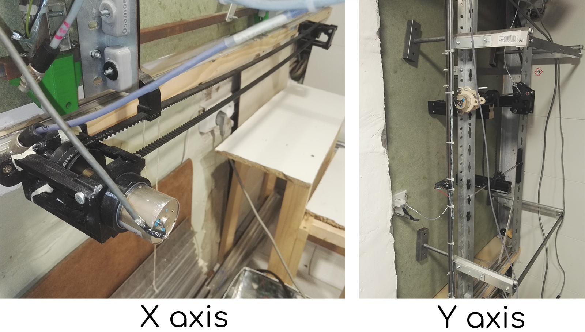
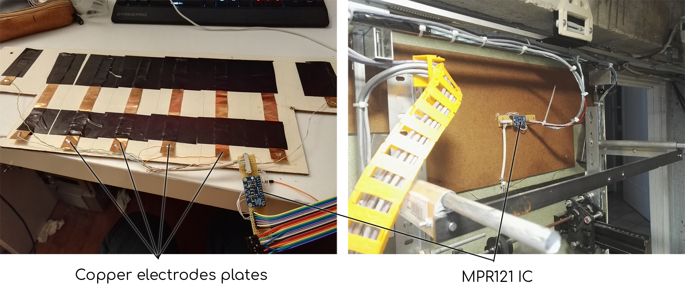

# Automated door & gesture triggers

Very short video overviewing the main features of the door, in action.

Automated door, with 2 axis linear movement, controlled by two brushed & gear reduced DC motors, and 2 sets of mechanical drives, with HTD timing belts and pulleys.

The longest axis is rolling on cupboard door rails, while the shortest axis is moving with custom built and lubricated aluminum tube and rods sliding in each other.

Most of the mechanical parts driving the movements are 3D printed, while the structural elements are cut and drilled by hand from raw aluminum and steel stocks available at local store.

The door opening is triggered either by pushing one of the 4 endstops, when inside the room, or by **sweeping from left to right** the hand close to the top of the door.

This detection is made possible with the use of an integrated circuit that measures the capacitance between up to 8 channels, and a common reference.

With the use of large enough copper sheets as electrodes, disposed in a linear pattern, one can thus record the movement of objects one one axis, as long as these objects induce a change in capacitance with "antenna" effect, as water does, and the human body containing a large fraction of it, so does it too.

