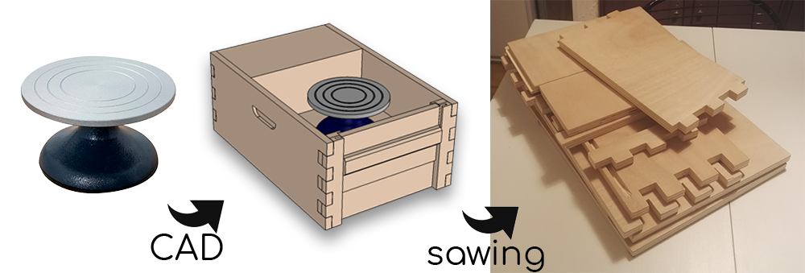
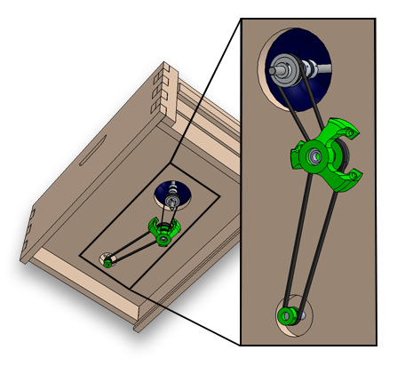
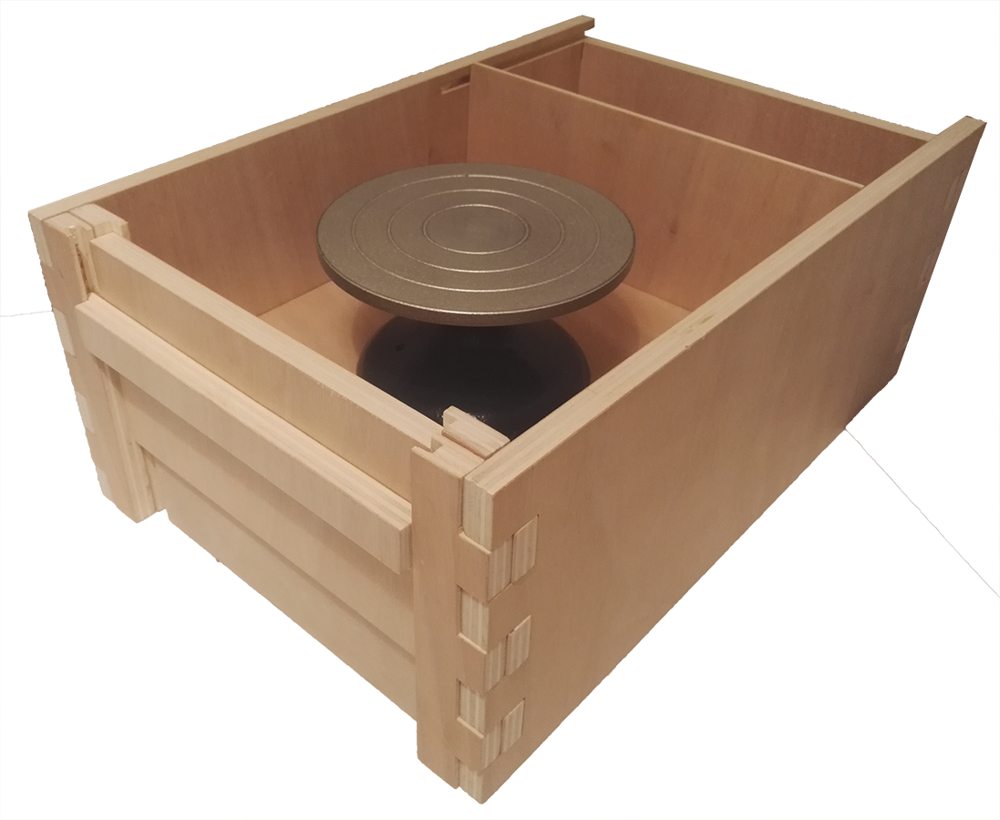
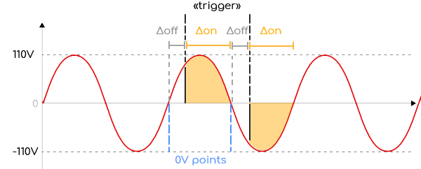

# Potter's Wheel : 

Starting with a cheap table potter's ["tournette"](https://loisir-creatif-fr.buttinette.com/shop/a/tournette-de-potier-11-x-18-cm-51128), i modeled an enclosure in thick plywood, with apertures to clean exess water and mud after work.

To motorize the whell i decided to use an old asnychronous 220 V motor from a disposed blender. The motor is running without load at 3600 rpm. I found that most potters wheel range up to 200 rpm. 

The reduction ratio for the belts and pulleys should then be 18:1.

I managed to find small pulleys at the common format GT2 and printed the other ones to match the given ratio.

The whole assembly complete, it was time to make the wheel driveable by a user.

To control an asynchronous motor speed, a possible easy solution is to use triacs and Phase detectors to allow current to pass to the motor in phase with the 50Hz oscillation of the grid, but more or less delayed from the 0V point depending on how much energy we want to inject in the motor.

The energy received by the motor over time is then related to the area under the curve of the 200V grid, from the timing at wich we pull the "trigger" to the next 0V point, at which the triacs resets itself and cut open the 220V circuit to the motor.

 

The measure of the phase of the 220V is measured with an optocoupler, by an arduino (optocoupler are usually used when one wants to transmit signals from high voltage components to logic levels, to prevent destruction of material)

This arduino simply recieves analog inputs from a potentiometer or a pedal (in which sits a linear variable resistance), wich controls the duration of the Δoff epoch.