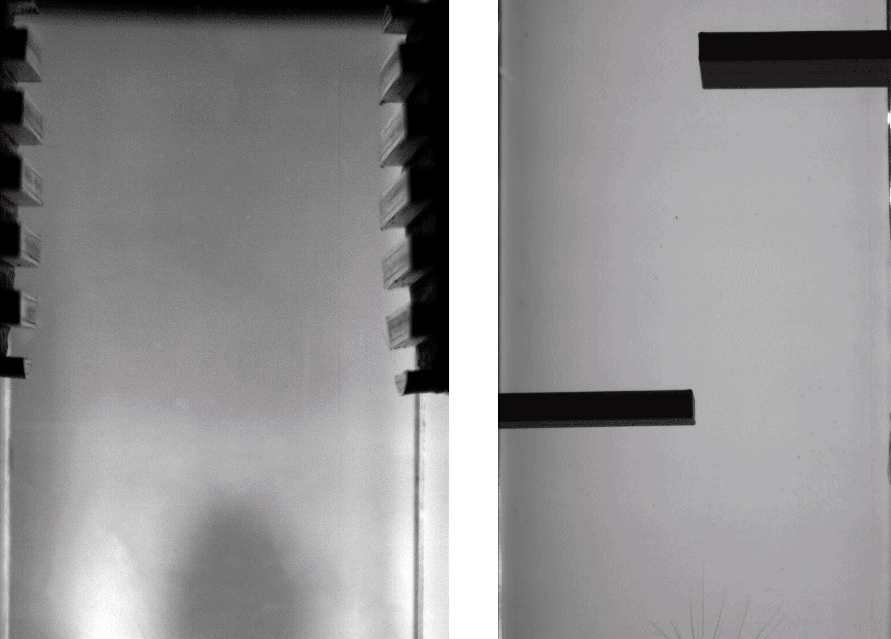

# Automated behavioral arena

Using actuators, sensors, controlled with custom electronic hardware and acquisition systems to perform fully automated and freely moving behavioral training to various tasks.

## In short :

To perform locomotion and tactile discrimination tasks, we developed and automated modular arena, that allows us to display various tactile stimuli and obstacles, and set their position automatically to train models to their presence and their nature.

The central alley is transparent and thus, allows us to record high speed videography of models trajectories and whisker contacts, as displayed below, for two different types of tasks. On the left, orientation discrimination, and on the right, obstacle avoidance.

The full automation of the task and the use of rewards allows us to obtain better characterized and repeatable behaviors.

