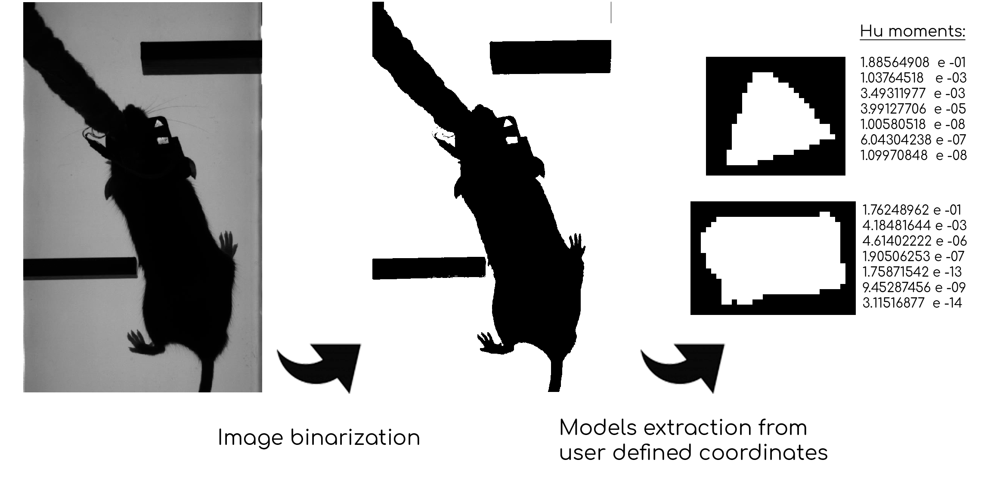
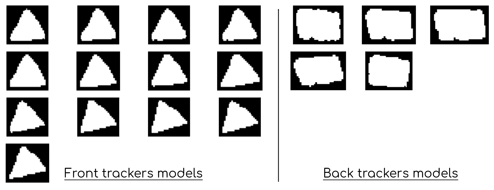
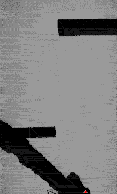

# Tracker shape based automated head tracking

To extract precisely the position and orientation of items over time from large video datasets, I developed an interface that allows a user to define a number of trackers to identify and select one "model" for each tracker, to start the tracking.

The user is asked to identify other models of the same tracker simply by clicking at their position in the image, each time the algorithm fails to find a matching tracker with a good confidence, for the selected frame. The tracker is then added to a list of valid shapes, from which the one with the highest confidence to a given frame is used.

The calculation of the matching between two shapes, one binary volume and a model, is based on **hu-moment** values. These are seven values that are calculated from the contour coordinates of the binarized shape and are, invariant to translation, rotation and scale.

Once a certain number of supplementary trackers are added, usually around a dozen, the algorithm can perform with a very good performance on it's own, under identical lighting conditions.

