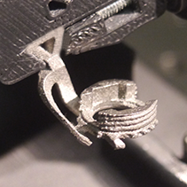

# Head implant for fluorescence imaging

Attaching a multi-core fiber optical image guide to freely behaving models.

## Overview :

<u>Requirements :</u>

- Allow for very firm fixation to avoid movement artifacts. (fluorescence signals max~ 1% DeltaF/F)
- Plugg / unpluggable to perform daily training.

- Opened sides for craniotomy
- Adjustable depth for fiber resting position to adapt for model variances
- Ridged surface for strong bond with dental cement
- Low weight and small size .
- Morphologically adapted to area desired for imaging.

<u>Adopted design :</u>

Manufactured in Titanium, with laser sintering 3D printing techinque. Flat critical surfaces like head post and ring resting plane polished by hand. 

## Details :

VSD awake staining : using high resolution SLA 3D printing with flexible resin to create liquid tight chamber.

Protection across days : head cap made in plastic with markings to identify models.

