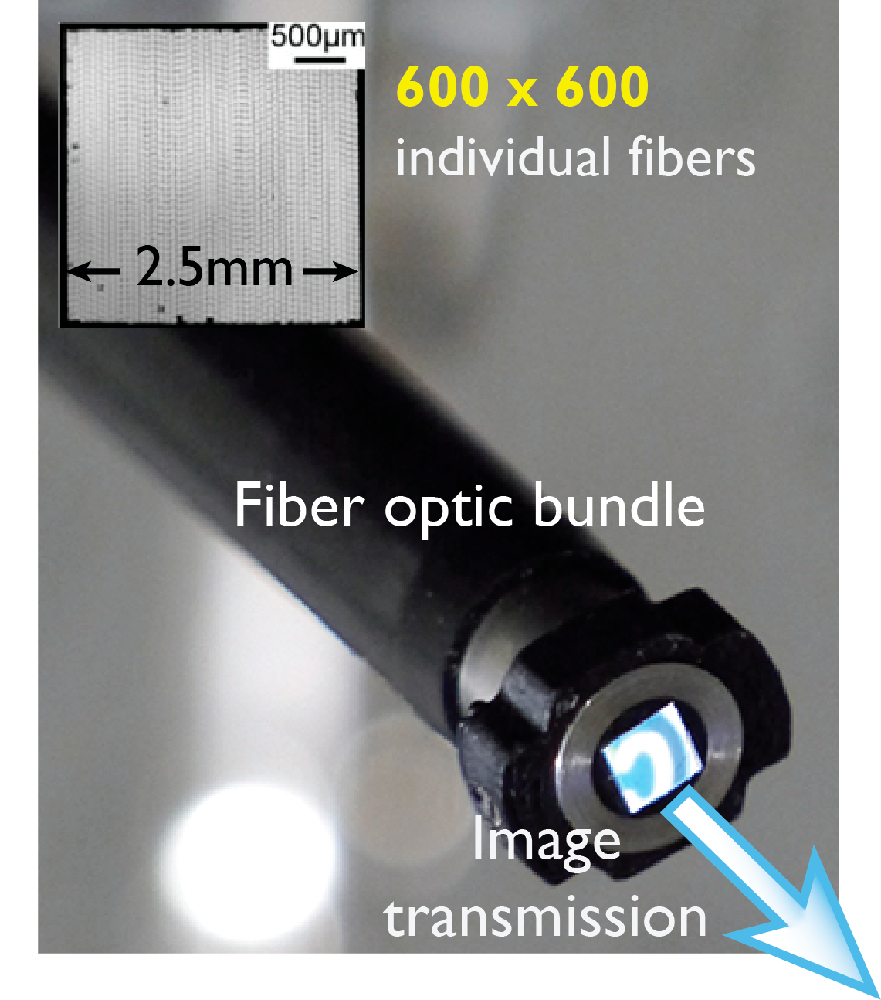
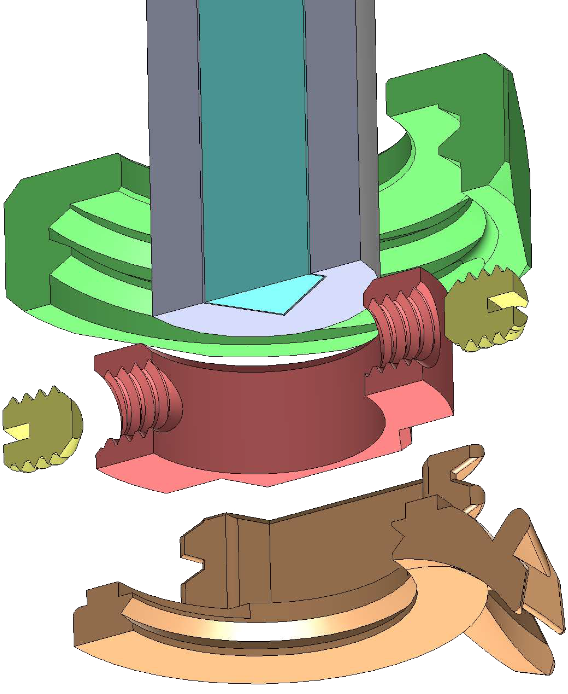

# Head implant for fluorescence imaging

Attaching a multi-core fiber optical image guide to freely behaving models.

## In short :

Miniature implant system to perform stable and precise mesoscale cortical imaging on freely behaving models.

Using a fiber optic bundle illustrated below, we record cortical fluorescence signals at a mesoscale resolution.

Photograph of the implant held in the headpost:

The variation of fluorescence is measured and is on the order of magnitude of 1% (with Voltage Sensitive Dye RH1691).

Thus, to be able to attach and detach easily this optical image guide to perform training, and to still be able to obtain a very stable fixation in order to avoid any measure of light variation that my be due to improper fixation, we designed a concentric fixation system in a tight space, and with a tiny weight (1.2g).

Moreover, to perform certain types of cortical fluorescence imaging requiring dyes, one needs to be able to perform staining prior to experiment. For this reason, the implant features opened sides, as can be seen in the image above.

Schematic of the implant holding the fiber bundle over the cortex

The system works with first, a loose locking nut being passed through the fiber optic bundle. 

Then, a tight fitted ring is fixed to the fiber optic end with a small M2 setscrew. The distance from the very tip of the fiber bundle and the adjustable ring sets the depth the fiber will sit at, once the assembly is fully locked.

The ring is then fitted inside the implant, and because this ring has a partially hexagonal shape (as illustrated in red below) that matches the inside of the implant, the rotational position is then locked.

3D section view of the implant components

Finally, the locking nut is screwed onto the implant and doing so, push the slightly over-heighted adjustable depth ring into the implant until it is fully locked.

Here, you can see animated the complete operation, in section view.

Animation displaying the fixation process in section view

Here is another representation to picture the scale of the whole implant and fiber bundle with the skull of the model.

Implant and fiber elements at scale and in position over the model's skull

_____________

## Details:

#### Requirements :

- Allow for very firm fixation to avoid movement artifacts. (fluorescence signals max~ 1% DeltaF/F)
- Plugg / unpluggable to perform daily training.

- Opened sides for craniotomy
- Adjustable depth for fiber resting position to adapt for model variances
- Ridged surface for strong bond with dental cement
- Low weight and small size .
- Morphologically adapted to area desired for imaging.

The implant material is titanium, for it's high strength to weight ratio, and manufactured with 3D printing "laser sintering" technique.

| **Material properties** | **Steel**   | **Titanium** | Aluminium  |
| ----------------------- | ----------- | ------------ | ---------- |
| Density                 | 7.8-8 g/cm3 | 4.43 g/cm3   |            |
| Modulus of Elasticity   | 200 GPa     | 116 GPa      |            |
| Tensile Yield strength  | 350 MPa*    | 1186 MPa*    | 241 MPa    |
| Elongation at Break     | 15%*        | 10%          | **10%**    |
| Hardness (Brinell)      | 121*        | 40 HRB       | **45 HRB** |

\*  *varies widely based on alloy & heat treatment*

https://www.thomasnet.com/articles/metals-metal-products/steel-vs-titanium-strength-properties-and-uses/
https://www.nuclear-power.net/nuclear-engineering/metals-what-are-metals/alloys-composition-properties-of-metal-alloys/steel-vs-titanium-comparison-pros-and-cons/

<!--VSD awake staining : using high resolution SLA 3D printing with flexible resin to create liquid tight chamber.-->

<!--Protection across days : head cap made in plastic with markings to identify models.-->

